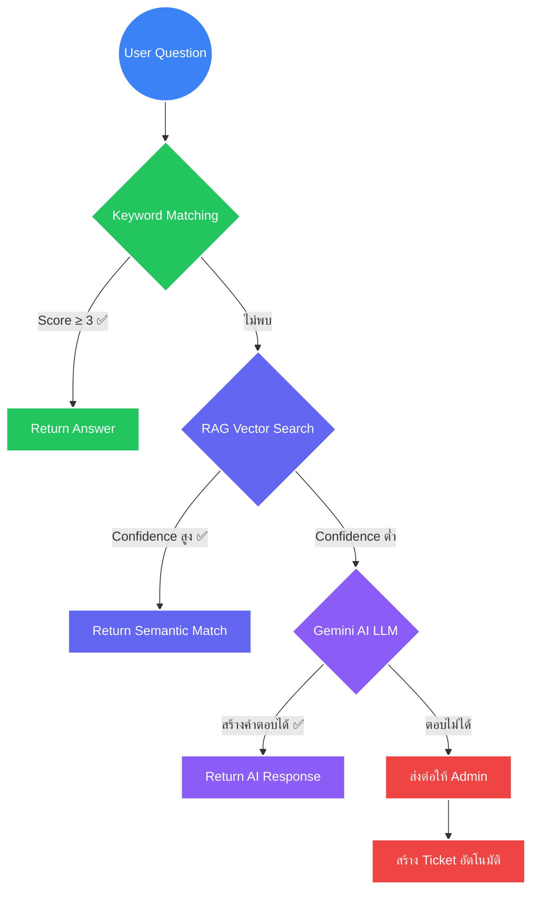
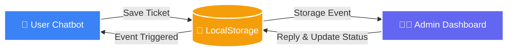

# IT Support Chatbot

> **แชทบอท AI HelpDesk แบบ Open-source พร้อมระบบ FAQ อัตโนมัติ, ส่งต่อ Ticket, Admin Dashboard และการตอบกลับด้วย AI**

<div align="center">

<i>👉 <a href="README.md">🇬🇧 Read in English</a></i><br><br>

 

[](https://github.com/romeototo/it-support-chatbot/releases)
[](https://github.com/romeototo/it-support-chatbot/actions)
[](https://romeototo.github.io/it-support-chatbot/)
[](https://python.org)
[](https://flask.palletsprojects.com)
[](https://www.trychroma.com)
[](https://ai.google.dev)
[](LICENSE)

**[User Chatbot](https://romeototo.github.io/it-support-chatbot/)** · **[Admin Dashboard](https://romeototo.github.io/it-support-chatbot/dashboard.html)** · **[แจ้งบัก](https://github.com/romeototo/it-support-chatbot/issues/new?template=bug_report.md)** · **[เสนอฟีเจอร์](https://github.com/romeototo/it-support-chatbot/issues/new?template=feature_request.md)**

</div>

---

## ภาพรวม

**IT Support Chatbot** เป็นโปรเจค Open-source สำหรับสร้างระบบ AI HelpDesk ที่ออกแบบมาสำหรับทีม IT ขนาดเล็ก คนที่กำลังเรียนรู้งาน HelpDesk และนักพัฒนาที่ต้องการตัวอย่างระบบ Automation จริงๆ โปรเจคนี้สาธิต Workflow การซัพพอร์ตแบบครบวงจร — ตั้งแต่จับคู่ FAQ ไปจนถึงสร้าง Ticket และ Admin ตอบกลับ — โดยใช้ Hybrid Search Engine 3 ชั้น (Keyword → Vector → LLM)

รันได้ทั้งแบบ Static Demo บน GitHub Pages (ไม่ต้องมี Backend เลย) หรือแบบ Full-stack Flask พร้อม ChromaDB Vector Search และเชื่อมต่อ Gemini AI ได้ตามต้องการ

---

## ใครควรใช้โปรเจคนี้

โปรเจคนี้เหมาะสำหรับ:

- **ทีม IT ขนาดเล็ก** ที่อยากออโตเมทงานซัพพอร์ต Tier 1 โดยไม่ต้องใช้แพลตฟอร์ม SaaS ราคาแพง
- **คนที่กำลังเรียนรู้งาน HelpDesk** อยากดูว่า Ticket Workflow และ AI Search Pipeline สร้างขึ้นมายังไงในทางปฏิบัติ
- **นักพัฒนาสาย Automation** ที่ต้องการตัวอย่างระบบ Hybrid Search แบบ Keyword + Vector + LLM ที่ใช้งานได้จริง
- **Developer** ที่สร้างเครื่องมือ AI Support ด้วย Python กับ Vanilla JavaScript
- **นักศึกษาและอาจารย์** ที่ต้องการตัวอย่าง RAG ใน Domain จริงๆ ไม่ใช่แค่ Tutorial

โปรเจคนี้เป็น **Reference Implementation และ Demo** ไม่ได้เป็นผลิตภัณฑ์ SaaS พร้อมใช้งานจริง ไม่ได้ Claim ว่ามี Enterprise-grade Reliability, SLA หรือ Active Community ขนาดใหญ่

---

## ทำไมโปรเจคนี้ถึงสำคัญ

เครื่องมือ AI HelpDesk ส่วนใหญ่ในตลาด ถ้าไม่ซับซ้อนเกินไปแบบ Enterprise ก็เรียบง่ายเกินไปแบบ Tutorial จนเอาไปใช้จริงไม่ได้ โปรเจคนี้อยู่ตรงกลาง — เป็น Chatbot ที่ใช้งานได้จริง, Self-host ได้, Open-source และครอบคลุม Workflow ซัพพอร์ตทั้งหมดโดยไม่ผูกกับ Vendor ไหน

การตัดสินใจออกแบบหลักๆ:

- **ไม่ต้องมี Database Server** สำหรับ Static Deployment — Demo รันบน GitHub Pages ได้เลย ค่าโฮสต์เกือบศูนย์ Ticket ซิงค์ข้ามแท็บผ่าน `localStorage`
- **Search 3 ชั้น** (Keyword → Vector → LLM) ถ้า AI ใช้ไม่ได้ ระบบก็ยัง Fallback ลงมาได้อย่างราบรื่น
- **Gemini AI เป็น Optional** — ระบบทำงานได้โดยไม่มี AI โดย Fallback ไปใช้ RAG และ Keyword Search
- **ข้อมูลอยู่ในเครื่องทั้งหมด** — ไม่มีการเก็บ Analytics, Telemetry หรือส่งข้อมูลไปบริการภายนอก

---

## ฟีเจอร์

| ฟีเจอร์ | รายละเอียด |
| ------- | ----------- |
| 🔍 **Hybrid Search Engine** | ค้นหา 3 ชั้น: Keyword Matching → ChromaDB RAG → Gemini AI LLM |
| 📚 **FAQ Knowledge Base** | ฐานข้อมูลในตัว 202 FAQ ครอบคลุม 45 หมวดหมู่ IT |
| 🎫 **Ticket Handoff** | สร้าง Ticket อัตโนมัติเมื่อระบบค้นหาตอบไม่ได้ |
| 👨‍💼 **Admin Dashboard** | หน้าจอ HelpDesk สำหรับจัดการ Ticket, อัปเดตสถานะ และ Canned Responses |
| ⚡ **Real-Time Sync** | ซิงค์ข้อมูลข้ามแท็บระหว่าง User กับ Admin ผ่าน Web Storage API |
| ⌨️ **Typing Indicator** | สถานะ "Admin กำลังพิมพ์…" ซิงค์แบบ Real-time |
| 📊 **Live Analytics** | สรุปหมวดหมู่ปัญหาและ Resolution Rate ด้วย Chart.js |
| 🤖 **Gemini AI Toggle** | เปิดใช้ LLM ได้ด้วย API Key จาก Google AI Studio |
| 💎 **Glassmorphism UI** | Dark/Light Mode สลับได้ พร้อม Micro-animations |
| 🌐 **Dual Deploy Mode** | รันได้ทั้งแบบ Static (GitHub Pages) และ Full-stack Flask |
| 🔒 **XSS Protection** | Admin Dashboard ทำ Sanitize Input ทั้งหมดก่อนแสดงผล |
| 📋 **Copy to Clipboard** | คัดลอกคำตอบได้ในคลิกเดียว |
| 👍👎 **Feedback System** | ให้คะแนนคำตอบได้ บันทึกใน Browser แบบ Local |

---

## กรณีการใช้งาน

| สถานการณ์ | โปรเจคนี้ช่วยได้ยังไง |
| -------- | ---------------------- |
| IT HelpDesk Demo สำหรับบริษัทขนาดเล็ก | Deploy บน GitHub Pages แล้วส่งลิงก์ให้พนักงาน |
| เรียนรู้วิธีสร้าง RAG Search Pipeline | อ่านโค้ด `chatbot.py`, `rag_engine.py` และ `init_rag.py` |
| ทดลองสร้างระบบ Ticket Handoff | ต่อยอด REST Routes ใน `web_app.py` กับ `dashboard.html` |
| สร้าง Backend สำหรับ LINE / Slack Bot | ใช้ `line_webhook_template.py` เป็นจุดเริ่มต้น |
| สอน AI + HelpDesk Integration | Fork แล้วปรับ Knowledge Base ให้เหมาะกับ Domain ที่ต้องการ |

---

## สถาปัตยกรรม

### Hybrid Search Engine



### Real-Time Sync (Serverless Demo)

โหมด Static Deployment ใช้ `localStorage` + `storage` event API ของ Browser เพื่อซิงค์ Ticket ระหว่างหน้า User Chatbot กับ Admin Dashboard โดยไม่ต้องมี Backend Server — ออกแบบมาสำหรับ Demo



### Tech Stack

```
Frontend:  HTML5 + Vanilla CSS (Glassmorphism) + JavaScript (ES6+)
Backend:   Python 3.10+ + Flask + ChromaDB (Vector DB)
AI Engine: Hybrid (Keyword Match → RAG → Gemini 2.0 Flash)
Deploy:    GitHub Pages (Static Demo) / Local Flask (Full-stack)
```

---

## เริ่มต้นใช้งาน

### Option A — GitHub Pages Demo (ไม่ต้องติดตั้งอะไรเลย)

ลองเล่น Demo ได้ที่ **[https://romeototo.github.io/it-support-chatbot/](https://romeototo.github.io/it-support-chatbot/)**

เปิดทั้ง [หน้า Chatbot](https://romeototo.github.io/it-support-chatbot/) กับ [Admin Dashboard](https://romeototo.github.io/it-support-chatbot/dashboard.html) คู่กันเพื่อดูการซิงค์ Ticket แบบ Real-time

> **หมายเหตุ:** Demo บน GitHub Pages ใช้ `localStorage` เก็บ Ticket ข้อมูลอยู่ใน Browser เท่านั้น ไม่ได้แชร์ข้ามอุปกรณ์หรือข้ามผู้ใช้

### Option B — Local Full-Stack (พร้อม RAG Backend)

```bash
# 1. Clone repo
git clone https://github.com/romeototo/it-support-chatbot.git
cd it-support-chatbot

# 2. ติดตั้ง Python dependencies
pip install -r requirements.txt

# 3. สร้าง Vector Database
python init_rag.py

# 4. รัน Flask Server
python web_app.py

# 5. เปิด http://localhost:5000 ใน Browser
```

### Option C — เปิดใช้ Gemini AI

1. รับ API Key ฟรีที่ [Google AI Studio](https://aistudio.google.com)
2. กดปุ่ม ⚙️ ที่มุมขวาบนใน Chatbot UI
3. วาง API Key แล้วกด **Activate AI**

Chatbot จะใช้ Gemini เป็น Fallback เมื่อ FAQ กับ RAG Search ให้ผลลัพธ์ไม่แม่นยำพอ

---

## การตั้งค่า

ไฟล์ `config.json` ควบคุมการตั้งค่า Runtime:

```json
{
  "rag_enabled": true,
  "gemini_enabled": false
}
```

| Key | ค่าเริ่มต้น | คำอธิบาย |
| --- | ------- | ----------- |
| `rag_enabled` | `true` | เปิดใช้ ChromaDB Vector Search เป็นชั้นค้นหาที่สอง |
| `gemini_enabled` | `false` | เปิดใช้ Gemini AI เป็นชั้นค้นหาที่สาม (ต้องใส่ API Key ตอน Runtime) |

ถ้าต้องการเพิ่มหรืออัปเดต FAQ ให้ใช้ Script ที่มีมาให้ ซึ่งจะ Sync ทั้ง `kb.js` (Static) และ `knowledge_base.json` (Backend) ให้อัตโนมัติ:

```bash
python add_faq.py
```

---

## โครงสร้างโปรเจค

```
it-support-chatbot/
├── index.html               # หน้า Chatbot สำหรับผู้ใช้ (Static, Glassmorphism UI)
├── dashboard.html           # Admin Dashboard (จัดการ Ticket + Chart.js)
├── kb.js                    # Knowledge Base — 202 FAQ สำหรับ GitHub Pages
├── knowledge_base.json      # Knowledge Base — FAQ Data สำหรับ Flask Backend
├── web_app.py               # Flask Server + REST API Routes
├── chatbot.py               # Hybrid Search Engine (Keyword + RAG + Gemini)
├── rag_engine.py            # ChromaDB Vector Search Engine
├── init_rag.py              # Script สำหรับ Ingest knowledge_base.json เข้า ChromaDB
├── add_faq.py               # เครื่องมือเพิ่ม FAQ แบบ Batch (sync kb.js + JSON)
├── line_webhook_template.py # Template สำหรับ LINE Messaging API Webhook
├── requirements.txt         # Python dependencies
├── config.json              # Runtime Configuration Flags
├── guide.html               # คู่มือการใช้งาน
└── .github/
    ├── workflows/
    │   ├── validate-kb.yml  # CI: ตรวจสอบโครงสร้าง Knowledge Base
    │   └── python-lint.yml  # CI: Python Code Linting
    └── ISSUE_TEMPLATE/
        ├── bug_report.md
        └── feature_request.md
```

---

## ตัวอย่าง Workflow

ลำดับการทำงานจริงตั้งแต่ต้นจนจบ:

1. **ผู้ใช้** พิมพ์: `"เชื่อมต่อ VPN ไม่ได้"`
2. **Keyword Matching** สแกนหา Keyword ที่ตรงกัน — ไม่พบคำที่แม่นยำพอ
3. **RAG Search** ค้นใน ChromaDB — เจอ FAQ ที่ใกล้เคียงได้ Confidence 0.72 (ต่ำกว่า Threshold)
4. **Gemini AI** สร้างคำตอบจาก Context ของ FAQ ที่ใกล้เคียงที่สุด
5. **ผู้ใช้** ไม่พอใจ → กดปุ่ม "ส่งต่อให้ IT"
6. **ระบบสร้าง Ticket** แล้วแสดงใน Admin Dashboard ทันที
7. **Admin** พิมพ์ตอบ → ผู้ใช้เห็นสถานะ "Admin กำลังพิมพ์…" แบบ Real-time
8. **Admin** ปิด Ticket → กราฟ Analytics อัปเดตอัตราการแก้ปัญหา

---

## Screenshots / Demo

| User Chatbot | Admin Dashboard |
| ------------ | --------------- |
|  |  |

**Live Demo:** [https://romeototo.github.io/it-support-chatbot/](https://romeototo.github.io/it-support-chatbot/)

---

## AI Coding Tools ที่ใช้ดูแลโปรเจคนี้

โปรเจคนี้ใช้ AI Coding Tools (รวมถึง OpenAI Codex) ช่วยให้ผู้ดูแลคนเดียวรักษาคุณภาพได้ในระดับที่ปกติต้องใช้ทีม:

- **จัดลำดับ Issue** — สรุปและจัดหมวดหมู่ Bug Report กับ Feature Request ที่เข้ามา
- **Code Review** — ตรวจหาจุดบกพร่องใน Logic ของ Hybrid Search Fallback Chain
- **สร้าง Documentation** — ดูแลให้ README, CONTRIBUTING และ Comment ในโค้ดอัปเดตตาม Codebase ที่เปลี่ยนไป
- **สร้าง Test Case** — เขียน Unit Tests สำหรับ Search Scoring ใน `chatbot.py` และ Retrieval Logic ใน `rag_engine.py`
- **ตรวจสอบคุณภาพคำตอบ** — Review คำตอบ FAQ ใน `knowledge_base.json` ว่าถูกต้องและครบถ้วน
- **Refactoring ที่ปลอดภัยกว่า** — แนะนำการเปลี่ยนแปลงทีละส่วนใน Flask Routes และ Frontend Sync Logic โดยไม่ทำให้ Static Deployment พัง

---

## แผนพัฒนา (Roadmap)

| Milestone | สถานะ |
| --------- | ------ |
| Static Deployment (GitHub Pages) | ✅ เสร็จแล้ว |
| Flask Full-stack Backend | ✅ เสร็จแล้ว |
| ChromaDB RAG Integration | ✅ เสร็จแล้ว |
| Gemini AI Optional Layer | ✅ เสร็จแล้ว |
| Admin Dashboard พร้อม Real-time Sync | ✅ เสร็จแล้ว |
| LINE Messaging API Webhook Template | ✅ เสร็จแล้ว |
| Unit Tests สำหรับ Search Engine Core | 🔲 วางแผนไว้ |
| Docker / Compose Deployment | 🔲 วางแผนไว้ |
| FAQ หลายภาษา | 🔲 วางแผนไว้ |
| Webhook Integration ตัวอย่าง (Slack, Teams) | 🔲 วางแผนไว้ |
| Persistent Backend ด้วย PostgreSQL | 🔲 วางแผนไว้ |

---

## ข้อจำกัด

โปรเจคนี้เป็น Reference Implementation และ Demo ควรทราบข้อจำกัดเหล่านี้ก่อนนำไปใช้งานจริง:

- **ไม่มีระบบ Authentication** — Admin Dashboard ไม่มีหน้า Login ใครที่มี URL ก็เข้าได้ อย่าเปิดให้เข้าถึงจากภายนอกโดยไม่เพิ่มระบบ Authentication ก่อน
- **localStorage ไม่ใช่ Database** — Demo บน GitHub Pages เก็บ Ticket ไว้ใน Browser ถ้าล้าง Cache ข้อมูลจะหาย และไม่ได้แชร์ข้ามอุปกรณ์
- **SQLite ในโหมด Flask** — Flask Backend ใช้ไฟล์ SQLite (`tickets.db`) ในเครื่อง ไม่ได้ออกแบบมาสำหรับ Production ที่มีผู้ใช้พร้อมกันหลายคน
- **ยังไม่มี Unit Tests** — Logic ของ Search Engine ใน `chatbot.py` กับ `rag_engine.py` ยังไม่มี Automated Test Coverage อยู่ใน Roadmap
- **ต้องพึ่ง Gemini API** — ชั้น LLM ต้องใช้ API Key จาก Google AI Studio ส่วน Rate Limit และความพร้อมของ Model อยู่นอกเหนือการควบคุมของโปรเจคนี้
- **Knowledge Base เป็นภาษาไทย** — FAQ ที่มีมาให้เขียนเป็นภาษาไทย ถ้าต้องการใช้ภาษาอื่นต้องแปลหรือแทนที่ `knowledge_base.json` กับ `kb.js`
- **ไม่ได้ผ่านการใช้งาน Production** — โปรเจคนี้ยังไม่เคยทดสอบใน Production Environment ใช้เป็น Reference สำหรับเรียนรู้และเป็นจุดเริ่มต้น ไม่ใช่ Drop-in Solution

---

## การมีส่วนร่วม (Contributing)

ยินดีรับ Contribution ทุกรูปแบบ กรุณาอ่าน [CONTRIBUTING.md](CONTRIBUTING.md) ก่อนส่ง Pull Request

สำหรับแจ้งบัก ใช้ [Bug Report Template](https://github.com/romeototo/it-support-chatbot/issues/new?template=bug_report.md)
สำหรับเสนอฟีเจอร์ ใช้ [Feature Request Template](https://github.com/romeototo/it-support-chatbot/issues/new?template=feature_request.md)

---

## ความปลอดภัย (Security)

หากพบช่องโหว่ด้านความปลอดภัย กรุณาทำตามขั้นตอน Responsible Disclosure ที่อธิบายไว้ใน [SECURITY.md](SECURITY.md) อย่าเปิด Issue สาธารณะสำหรับรายงานด้านความปลอดภัย

ประเด็นด้านความปลอดภัยที่ควรทราบ:

- Static Demo เก็บข้อมูลทั้งหมดใน `localStorage` ของ Browser — ไม่มีการเก็บข้อมูลฝั่ง Server
- Flask Backend เก็บ Ticket ใน `tickets.db` ในเครื่อง — ไม่มีการ Sync ไป Cloud หรือส่งข้อมูลออกภายนอก
- ป้องกัน XSS ใน Admin Dashboard ด้วย `escapeHtml()` สำหรับข้อมูลทุกอย่างที่มาจากผู้ใช้
- ไม่มี Analytics, Tracking หรือ Telemetry ใดๆ ในโปรเจคนี้

---

## License

โปรเจคนี้ใช้ MIT License ดูรายละเอียดเต็มได้ที่ [LICENSE](LICENSE)

ใช้งานได้ฟรีทั้ง Personal และ Commercial

---

## ผู้ดูแล

**Romeo T.**
GitHub: [@romeototo](https://github.com/romeototo)

<div align="center">

Made with care · Python · ChromaDB · Gemini AI

</div>
