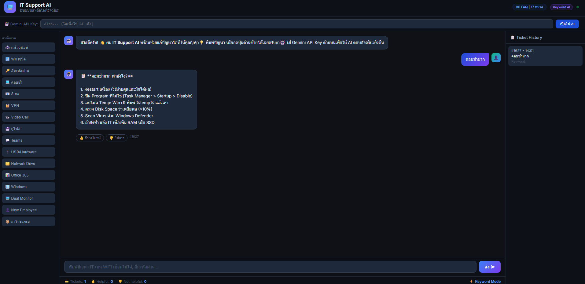

# 🖥️ IT Support AI Chatbot

[](https://romeototo.github.io/it-support-chatbot/)
[](https://python.org)
[](https://flask.palletsprojects.com)
[](LICENSE)

> ระบบ AI Chatbot สำหรับช่วยงาน IT Support ภายในองค์กร  
> ตอบคำถามปัญหาไอทีได้ทันที ลด Ticket และประหยัดเวลา IT Team

---

## 🚀 Live Demo

**👉 [เปิด Demo ได้เลย](https://romeototo.github.io/it-support-chatbot/)**



---

## ✨ Features

| Feature | รายละเอียด |
|---|---|
| 💬 Chat Interface | UI สวย Dark Theme พร้อม Typing Animation |
| 🤖 Gemini AI | เชื่อมต่อ Google Gemini API ตอบอัจฉริยะ |
| 🔍 Keyword Fallback | Keyword Matching เมื่อไม่มี API Key |
| 📋 86 FAQ | ครอบคลุม 17 หมวดหมู่ปัญหา IT ทั่วไป |
| ⚡ Quick Actions | ปุ่มลัด 16 หัวข้อ กดได้เลย |
| 🎫 Ticket System | ออก Ticket Number + History Panel |
| 👍👎 Feedback | ปุ่มให้คะแนนทุก Ticket |
| 📊 Stats Bar | สถิติ Ticket / Helpful / Mode แบบ Real-time |
| 📱 Responsive | รองรับ Desktop + Mobile |
| 🌐 Standalone | ทำงานได้ใน Browser ไม่ต้อง Server |

---

## 📂 หมวดหมู่ FAQ (17 หมวด / 86 ข้อ)

```
🖨️ เครื่องพิมพ์          📶 WiFi / Network       📧 อีเมล / Outlook
💻 คอมพิวเตอร์            🔑 Password / Security  📦 Software
🔐 VPN / Remote Work     📹 Video Conference     📱 Mobile Device
💾 Backup / กู้ไฟล์      👤 Account / Permission  💬 Microsoft Teams
🔌 Hardware / USB         🗂️ Network Drive        📊 Office 365
🪟 Windows System         💡 และอื่นๆ อีกมาก
```

---

## 🛠️ Tech Stack

```
Frontend   → HTML5 + Vanilla CSS + JavaScript (ES6+)
Backend    → Python 3 + Flask
AI Engine  → Keyword Matching + Optional LLM API
Data       → JSON Knowledge Base (knowledge_base.json)
Deploy     → GitHub Pages (Frontend) / Any Server (Backend)
```

---

## ⚡ วิธีใช้งาน

### วิธีที่ 1 — เปิดใน Browser (ง่ายสุด)
```bash
# เปิดไฟล์ index.html ใน Browser โดยตรง
# ไม่ต้อง Install อะไรเพิ่ม
```

### วิธีที่ 2 — Web Mode (Flask)
```bash
# Clone โปรเจกต์
git clone https://github.com/romeototo/it-support-chatbot.git
cd it-support-chatbot

# ติดตั้ง Flask
pip install flask

# รัน Web App
python web_app.py
# เปิด http://localhost:5000
```

### วิธีที่ 3 — Terminal Mode
```bash
python chatbot.py
```

---

## 📁 โครงสร้างโปรเจกต์

```
it-support-chatbot/
├── 🌟 index.html              # Standalone Demo (GitHub Pages)
├── 🐍 chatbot.py              # Terminal Chatbot
├── 🌐 web_app.py              # Flask Web Application
├── 📚 knowledge_base.json     # FAQ Database (86 ข้อ / 17 หมวด)
├── 📄 README.md               # คู่มือนี้
├── 📄 HANDOFF.md              # รายละเอียดโปรเจกต์
└── 📄 GUIDE.md                # คู่มือการใช้งาน
```

---

## 🔧 การเพิ่ม FAQ

แก้ไขไฟล์ `knowledge_base.json`:

```json
{
  "name": "หมวดหมู่ใหม่",
  "keywords": ["keyword1", "keyword2"],
  "faqs": [
    {
      "question": "คำถาม?",
      "answer": "1. ขั้นตอนที่ 1\n2. ขั้นตอนที่ 2"
    }
  ]
}
```

---

## 🗺️ Roadmap

- [x] Keyword Matching Engine
- [x] Flask Web UI
- [x] 86 FAQ / 17 หมวดหมู่
- [x] Standalone HTML Demo
- [x] GitHub Pages Deploy
- [x] Gemini AI Integration
- [x] Ticket History Panel
- [x] Feedback System (👍👎)
- [x] Mobile Responsive
- [x] Stats Dashboard
- [ ] LINE OA Bot
- [ ] Telegram Bot
- [ ] Admin Dashboard
- [ ] RAG + Vector Database

---

## 📞 ติดต่อ IT Support

```
📞 โทร: ext. 1234
📧 อีเมล: it-support@company.com
💬 Line: @company-it
🕐 จันทร์-ศุกร์ 8:30-17:30
```

---

## 👨‍💻 Author

**romeototo** — IT Support & Developer  
[](https://github.com/romeototo)

---

*สร้างด้วย ❤️ เพื่อลด Ticket และช่วยให้ทีม IT ทำงานได้มีประสิทธิภาพมากขึ้น*
