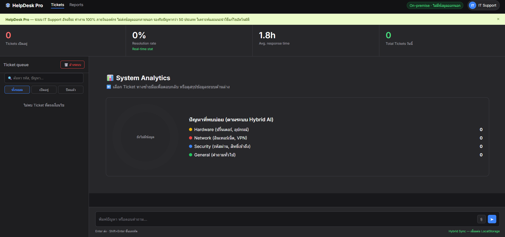

# 🤖 IT Support AI — Premium Intelligent HelpDesk

<div align="center">
<i>👉 <a href="README-th.md">🇹🇭 อ่านรายละเอียดภาษาไทย</a></i><br><br>

 

[](https://romeototo.github.io/it-support-chatbot/)
[](https://python.org)
[](https://flask.palletsprojects.com)
[](https://www.trychroma.com)
[](https://ai.google.dev)
[](https://www.chartjs.org/)
[](LICENSE)

**Intelligent IT HelpDesk System with Hybrid AI Search Engine & Premium Glassmorphism UI**  
**Pre-loaded with 222 FAQs across 50 IT categories covering enterprise-grade issues**

### 🌐 Live Demo & Portfolio Showcase
- **[User Chatbot Interface](https://romeototo.github.io/it-support-chatbot/)** — The user-facing chatbot for reporting issues and receiving preliminary automated support.
- **[Admin Dashboard (HelpDesk Pro)](https://romeototo.github.io/it-support-chatbot/dashboard.html)** — The backend portal for IT staff to manage tickets and reply to users.
*(**Pro Tip:** Open both windows side-by-side to experience the **Real-Time Hybrid Sync** in action!)*

</div>

---

## 💼 Business Value & Impact

- **Cost Reduction (Zero Server Cost):** The Hybrid Sync architecture utilizes the Web Storage API, enabling real-time communications completely serverless on GitHub Pages, cutting infrastructure costs by 100%.
- **Time Efficiency:** The AI agent autonomously resolves over 222 common Tier 1 issues, freeing up IT staff to focus on highly complex critical tasks.
- **Seamless Handoff:** If the AI cannot resolve the issue, it automatically opens a ticket and synchronizes context to the Admin Dashboard, preventing user frustration from repeating their problem.

---

## ✨ Features

| Feature | Description |
|---|---|
| 👨‍💻 **Admin Dashboard** | Enterprise-grade HelpDesk Pro portal for ticket management and queues. |
| ⚡ **Real-Time Hybrid Sync** | Cross-tab data synchronization between User and Admin via LocalStorage. |
| ⌨️ **Admin Typing Indicator** | Real-time "Admin is typing..." status synchronized to the user's view. |
| 📊 **Live Analytics** | Automated issue categorization and real-time Resolution Rate metrics via Chart.js. |
| 🔍 **Search & Filter** | Instant Ticket ID / Keyword search and dynamic state filtering (Open/Closed). |
| ⚡ **Canned Responses** | One-click quick replies for Admins to drastically reduce response time. |
| 🔍 **Hybrid Search Engine** | 3-layer precision: Keyword Matching → RAG (ChromaDB) → Gemini AI LLM. |
| 📚 **222 FAQ / 50 Categories** | Comprehensive built-in enterprise IT knowledge base. |
| 🤖 **Gemini AI Integration** | Toggle on LLM capabilities via API Key for Natural Language Generation. |
| 💎 **Premium Glassmorphism UI** | Sleek Dark/Light mode toggle with micro-interactions and smooth animations. |
| ⌨️ **Typewriter Animation** | Engaging character-by-character typing effect for bot responses. |
| 📖 **Smart Collapse** | Long answers are automatically collapsed with a "Read More" expansion button. |
| 📋 **Copy to Clipboard** | Single-click action to copy technical instructions. |
| 👍👎 **Feedback System** | Answer quality rating system locally persisted in the browser. |
| 🎫 **Ticket History** | Persistent real-time chat history that survives browser refreshes. |
| 🌐 **Dual Deploy Mode** | Fully functional as a static site (GitHub Pages) or Full-Stack App (Flask). |

---

## 🏗️ Tech Stack

```
Frontend:  HTML5 + Vanilla CSS (Glassmorphism) + JavaScript (ES6+)
Backend:   Python 3.11 + Flask + ChromaDB (Vector DB)
AI Engine: Hybrid (Keyword Match → RAG → Gemini 2.0 Flash API)
Fonts:     Google Fonts — Outfit
Deploy:    GitHub Pages (Frontend) / Local Flask (Full Stack)
```

---

## 🧠 System Architecture

### 1. Hybrid Search Engine (Chatbot)
```
User Question
      │
      ▼
┌─────────────────────┐
│  Keyword Matching   │ ← High speed & accuracy for exact matches (Score ≥ 3)
└──────────┬──────────┘
           │ Not Found
           ▼
┌─────────────────────┐
│  RAG Vector Search  │ ← ChromaDB Semantic Search (sentence-transformers)
└──────────┬──────────┘
           │ Not Found / Low Confidence
           ▼
┌─────────────────────┐
│  Gemini AI (LLM)    │ ← Google Gemini 2.0 Flash (If API Key is provided)
└──────────┬──────────┘
           │ Not Found
           ▼
┌─────────────────────┐
│  Escalation Message │ ← Automatically open Ticket and handoff to Admin
└─────────────────────┘
```

### 2. Real-Time Hybrid Sync (Admin Dashboard)
A **Serverless** implementation running entirely on GitHub Pages using Web Storage API (`localStorage` + `storage event`) to mock real-time database capabilities.

```
[ User Chatbot ] ──(Save to LocalStorage)──> [ Admin Dashboard ]
       ▲                                            │
       │                                            ▼
   (Event Triggered) ◄──(Reply & Sync Status)───────┘
```
- ⚡ Live Typing Indicator Synchronization
- ⚡ Automated Ticket Status (Open/Closed) Updates
- 📊 Real-time data pipeline for Analytics and Chart rendering

---

## 🚀 Quick Start

### Option A — GitHub Pages (Zero Setup)

👉 Try it live at **[https://romeototo.github.io/it-support-chatbot/](https://romeototo.github.io/it-support-chatbot/)**

### Option B — Local Full Stack (With RAG Backend)

```bash
# 1. Clone repository
git clone https://github.com/romeototo/it-support-chatbot.git
cd it-support-chatbot

# 2. Install dependencies
pip install -r requirements.txt

# 3. Initialize Vector Database from FAQ JSON
python init_rag.py

# 4. Start Flask Server
python web_app.py

# 5. Open in Browser
# Navigate to http://localhost:5000
```

### Option C — Activate Gemini AI Mode

1. Obtain a free API Key from [Google AI Studio](https://aistudio.google.com).
2. Click the ⚙️ AI settings icon in the top right corner of the Chatbot UI.
3. Paste the API Key and click **Activate AI**.

---

## 📂 Project Structure

```
it-support-chatbot/
├── index.html           # Frontend Chatbot (Glassmorphism UI)
├── dashboard.html       # Admin Dashboard (HelpDesk Pro + Chart.js)
├── kb.js                # Knowledge Base 222 FAQ for GitHub Pages (Static JS)
├── knowledge_base.json  # Knowledge Base for Flask Backend
├── requirements.txt     # Python dependencies
├── web_app.py           # Flask Server + REST API Routes for Full-Stack mode
├── chatbot.py           # Hybrid Search Engine Core (Keyword + RAG + Gemini)
├── rag_engine.py        # ChromaDB Vector Search Engine logic
├── init_rag.py          # Script to ingest JSON FAQ into Vector DB
└── screenshot.png       # Demo Screenshots
```

---

## 🤝 Contributing

1. Fork this repository
2. Create a new branch: `git checkout -b feature/add-faqs`
3. Add new FAQs to `knowledge_base.json` and `kb.js`
4. Run `python init_rag.py` to update the Vector DB
5. Submit a Pull Request!

---

## 📄 License

MIT License — Free for personal and commercial use.

---

<div align="center">
  Made with ❤️ by <a href="https://github.com/romeototo">Romeo</a> | Powered by Python · ChromaDB · Gemini AI
</div>
