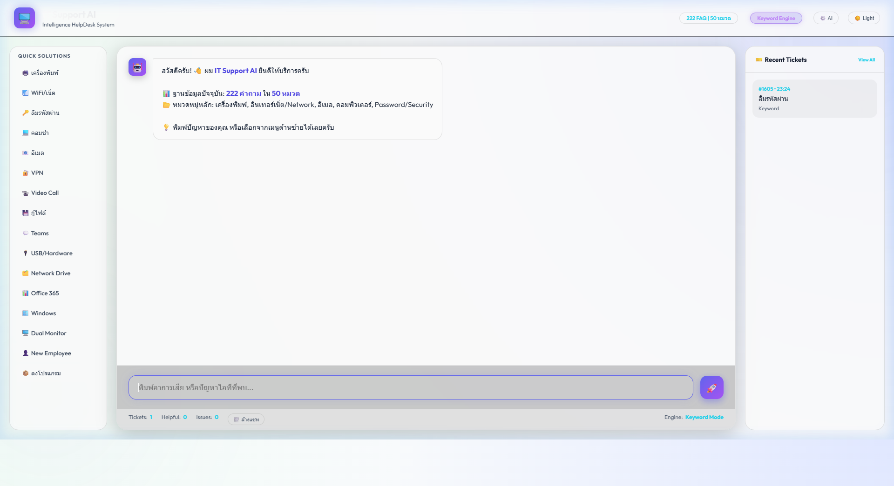
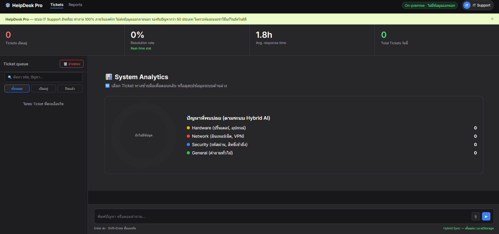
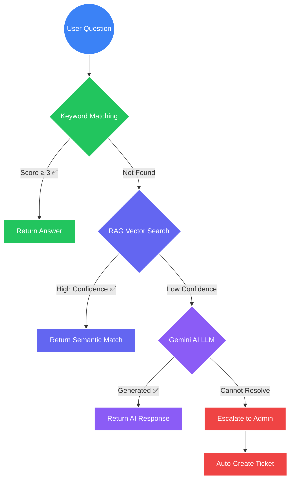
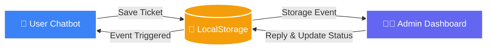

# IT Support Chatbot

> **Open-source AI helpdesk chatbot with FAQ automation, ticket handoff, admin workflow, and AI-powered IT support responses.**

<div align="center">

 

[](https://github.com/romeototo/it-support-chatbot/releases)
[](https://github.com/romeototo/it-support-chatbot/actions)
[](https://romeototo.github.io/it-support-chatbot/)
[](https://python.org)
[](https://flask.palletsprojects.com)
[](https://www.trychroma.com)
[](https://ai.google.dev)
[](LICENSE)

**[User Chatbot](https://romeototo.github.io/it-support-chatbot/)** · **[Admin Dashboard](https://romeototo.github.io/it-support-chatbot/dashboard.html)** · **[Report a Bug](https://github.com/romeototo/it-support-chatbot/issues/new?template=bug_report.md)** · **[Request a Feature](https://github.com/romeototo/it-support-chatbot/issues/new?template=feature_request.md)**

</div>

---

## Overview

**IT Support Chatbot** is an open-source reference implementation of a lightweight AI helpdesk system. It is designed for small IT teams, helpdesk learners, and automation builders who want a working example of an AI-powered support workflow — without enterprise overhead.

The project runs either as a fully static site on GitHub Pages (zero backend required) or as a full-stack Flask application with ChromaDB vector search and optional Gemini AI integration.

This repository is intended to help:

- **Small IT teams** looking to automate first-level support without expensive SaaS platforms
- **Helpdesk learners** studying how ticket workflows and AI search pipelines are built
- **Automation builders** who need a reference for hybrid keyword + vector + LLM search
- **Developers** building lightweight AI support tools with Python and vanilla JavaScript

---

## Why This Project Matters

Most AI helpdesk tools are either overly complex enterprise systems or overly simplified tutorials. This project fills the gap: a functional, self-hostable, open-source chatbot that covers the full support workflow — from FAQ matching to ticket creation to admin reply — with no proprietary lock-in.

Key design decisions:
- **No database server required** for the static deployment — tickets sync across tabs via `localStorage`
- **Three-layer search** (keyword → vector → LLM) degrades gracefully when AI is unavailable
- **Gemini AI is optional** — the system works without it by falling back to RAG and keyword search
- **All data stays local** — no external analytics or telemetry

---

## Features

| Feature | Description |
| ------- | ----------- |
| 🔍 **Hybrid Search Engine** | Three-layer precision: Keyword Matching → ChromaDB RAG → Gemini AI LLM |
| 📚 **FAQ Knowledge Base** | 202 pre-loaded FAQs across 45 IT categories (easily extensible) |
| 🎫 **Ticket Handoff** | Auto-creates a support ticket when AI cannot resolve the issue |
| 👨‍💼 **Admin Dashboard** | HelpDesk portal for ticket management, status updates, and canned responses |
| ⚡ **Real-Time Sync** | Cross-tab synchronization between user and admin via Web Storage API |
| ⌨️ **Typing Indicator** | "Admin is typing…" status synchronized in real time |
| 📊 **Live Analytics** | Issue categorization and resolution rate metrics via Chart.js |
| 🤖 **Gemini AI Toggle** | Activate LLM responses with an API key from Google AI Studio |
| 💎 **Glassmorphism UI** | Dark/light mode toggle with micro-interactions |
| 🌐 **Dual Deploy Mode** | Works as a static site (GitHub Pages) or full-stack Flask app |
| 🔒 **XSS Protection** | Admin dashboard sanitizes all user input before rendering |
| 📋 **Copy to Clipboard** | One-click copy for technical instructions |
| 👍👎 **Feedback System** | Answer quality rating persisted locally in the browser |

---

## Use Cases

| Scenario | How This Project Helps |
| -------- | ---------------------- |
| Internal IT helpdesk for a small company | Deploy on GitHub Pages; point staff to the chatbot URL |
| Learning how RAG search pipelines work | Read `chatbot.py`, `rag_engine.py`, and `init_rag.py` |
| Prototyping a ticket handoff flow | Extend `web_app.py` REST routes and `dashboard.html` |
| Building a LINE / Slack bot backend | Use `line_webhook_template.py` as a starting point |
| Teaching AI + helpdesk integration | Fork and adapt the knowledge base for any domain |

---

## Architecture

### Hybrid Search Engine


```mermaid
graph TD
    classDef keyword fill:#22c55e,stroke:#fff,stroke-width:2px,color:#fff
    classDef rag fill:#6366f1,stroke:#fff,stroke-width:2px,color:#fff
    classDef ai fill:#8B5CF6,stroke:#fff,stroke-width:2px,color:#fff
    classDef escalate fill:#ef4444,stroke:#fff,stroke-width:2px,color:#fff
    classDef user fill:#3b82f6,stroke:#fff,stroke-width:2px,color:#fff

    A((User Question)):::user --> B{Keyword Matching}:::keyword
    B -->|"Score ≥ 3 ✅"| C[Return Answer]:::keyword
    B -->|"Not Found"| D{RAG Vector Search}:::rag
    D -->|"High Confidence ✅"| E[Return Semantic Match]:::rag
    D -->|"Low Confidence"| F{Gemini AI LLM}:::ai
    F -->|"Generated ✅"| G[Return AI Response]:::ai
    F -->|"Cannot Resolve"| H[Escalate to Admin]:::escalate
    H --> I[Auto-Create Ticket]:::escalate
```

### Real-Time Sync (Serverless)

The static deployment uses the browser's `localStorage` + `storage` event API to synchronize tickets across the user chatbot and admin dashboard without any backend server.


```mermaid
graph LR
    classDef user fill:#3b82f6,stroke:#fff,stroke-width:2px,color:#fff
    classDef admin fill:#6366f1,stroke:#fff,stroke-width:2px,color:#fff
    classDef storage fill:#f59e0b,stroke:#fff,stroke-width:2px,color:#fff

    A["👤 User Chatbot"]:::user -->|"Save Ticket"| B[("💾 LocalStorage")]:::storage
    B -->|"Storage Event"| C["👨‍💼 Admin Dashboard"]:::admin
    C -->|"Reply & Update Status"| B
    B -->|"Event Triggered"| A
```

### Tech Stack

```
Frontend:  HTML5 + Vanilla CSS (Glassmorphism) + JavaScript (ES6+)
Backend:   Python 3.10+ + Flask + ChromaDB (Vector DB)
AI Engine: Hybrid (Keyword Match → RAG → Gemini 2.0 Flash)
Deploy:    GitHub Pages (static) / Local Flask (full-stack)
```

---

## Quick Start

### Option A — GitHub Pages (Zero Setup)

Try the live demo at **[https://romeototo.github.io/it-support-chatbot/](https://romeototo.github.io/it-support-chatbot/)**

Open both the [user chatbot](https://romeototo.github.io/it-support-chatbot/) and the [admin dashboard](https://romeototo.github.io/it-support-chatbot/dashboard.html) side-by-side to see real-time ticket sync in action.

### Option B — Local Full-Stack (With RAG Backend)

```bash
# 1. Clone the repository
git clone https://github.com/romeototo/it-support-chatbot.git
cd it-support-chatbot

# 2. Install Python dependencies
pip install -r requirements.txt

# 3. Initialize the vector database
python init_rag.py

# 4. Start the Flask server
python web_app.py

# 5. Open http://localhost:5000 in your browser
```

### Option C — Enable Gemini AI

1. Get a free API key from [Google AI Studio](https://aistudio.google.com)
2. Click the ⚙️ settings icon in the chatbot UI
3. Paste your API key and click **Activate AI**

The chatbot will then use Gemini as a fallback when FAQ and RAG search return low-confidence results.

---

## Configuration

The file `config.json` controls basic runtime settings:

```json
{
  "rag_enabled": true,
  "gemini_enabled": false
}
```

| Key | Default | Description |
| --- | ------- | ----------- |
| `rag_enabled` | `true` | Enable ChromaDB vector search as the second search layer |
| `gemini_enabled` | `false` | Enable Gemini AI as the third search layer (requires API key at runtime) |

To add or update FAQ entries, use the provided script which keeps both `kb.js` (static) and `knowledge_base.json` (backend) in sync:

```bash
python add_faq.py
```

---

## Project Structure

```
it-support-chatbot/
├── index.html               # User-facing chatbot (static, glassmorphism UI)
├── dashboard.html           # Admin dashboard (HelpDesk Pro + Chart.js)
├── kb.js                    # Knowledge base — 202 FAQs for GitHub Pages static mode
├── knowledge_base.json      # Knowledge base — FAQ data for Flask backend
├── web_app.py               # Flask server + REST API routes
├── chatbot.py               # Hybrid search engine core (keyword + RAG + Gemini)
├── rag_engine.py            # ChromaDB vector search engine
├── init_rag.py              # Script to ingest knowledge_base.json into ChromaDB
├── add_faq.py               # Batch FAQ management tool (syncs kb.js + JSON)
├── line_webhook_template.py # Starter template for LINE Messaging API webhook
├── requirements.txt         # Python dependencies
├── config.json              # Runtime configuration flags
├── guide.html               # User guide
└── .github/
    ├── workflows/
    │   ├── validate-kb.yml  # CI: validates knowledge base structure
    │   └── python-lint.yml  # CI: Python code linting
    └── ISSUE_TEMPLATE/
        ├── bug_report.md
        └── feature_request.md
```

---

## Example Workflow

A typical end-to-end interaction:

1. **User** types: `"I can't connect to the VPN"`
2. **Keyword matching** scans for known keywords — no strong match found
3. **RAG search** queries ChromaDB — returns a semantically close FAQ with confidence 0.72 (below threshold)
4. **Gemini AI** generates a contextual response based on the closest FAQ
5. **User** is not satisfied → clicks "Escalate to IT"
6. **Ticket is created** and appears instantly in the admin dashboard
7. **Admin** types a reply → user sees "Admin is typing…" in real time
8. **Admin** closes the ticket → resolution metrics update on the analytics chart

---

## Screenshots / Demo

| User Chatbot | Admin Dashboard |
| ------------ | --------------- |
|  |  |

**Live demo:** [https://romeototo.github.io/it-support-chatbot/](https://romeototo.github.io/it-support-chatbot/)

---

## How AI Coding Tools Help Maintain This Project

This project uses AI coding tools (including OpenAI Codex) to help with ongoing maintenance tasks:

- **Issue triage** — Summarizing and categorizing incoming bug reports and feature requests
- **Code review** — Identifying logic gaps in the hybrid search fallback chain
- **Documentation generation** — Keeping README, CONTRIBUTING, and inline comments up to date as the codebase evolves
- **Test-case creation** — Writing unit tests for `chatbot.py` search scoring and `rag_engine.py` retrieval logic
- **Support-response quality checks** — Reviewing FAQ answers in `knowledge_base.json` for accuracy and completeness
- **Safer refactoring** — Suggesting incremental changes to the Flask routes and frontend sync logic without breaking the static deployment

AI tools help a solo maintainer sustain the quality of an open-source project at a pace that would otherwise require a full team.

---

## Roadmap

| Milestone | Status |
| --------- | ------ |
| Static deployment (GitHub Pages) | ✅ Done |
| Flask full-stack backend | ✅ Done |
| ChromaDB RAG integration | ✅ Done |
| Gemini AI optional layer | ✅ Done |
| Admin dashboard with real-time sync | ✅ Done |
| LINE Messaging API webhook template | ✅ Done |
| Unit tests for search engine core | 🔲 Planned |
| Docker / Compose deployment | 🔲 Planned |
| Multi-language FAQ support | 🔲 Planned |
| Webhook integration examples (Slack, Teams) | 🔲 Planned |
| Persistent backend with PostgreSQL option | 🔲 Planned |

---

## Contributing

Contributions are welcome. Please read [CONTRIBUTING.md](CONTRIBUTING.md) before submitting a pull request.

For bug reports, use the [bug report template](https://github.com/romeototo/it-support-chatbot/issues/new?template=bug_report.md).  
For feature requests, use the [feature request template](https://github.com/romeototo/it-support-chatbot/issues/new?template=feature_request.md).

---

## Security

If you discover a security vulnerability, please follow the responsible disclosure process described in [SECURITY.md](SECURITY.md). Do not open a public issue for security reports.

---

## License

This project is licensed under the MIT License. See [LICENSE](LICENSE) for full terms.

Free for personal and commercial use.

---

## Maintainer

**Romeo T.**  
GitHub: [@romeototo](https://github.com/romeototo)

<div align="center">

Made with care · Python · ChromaDB · Gemini AI

</div>
